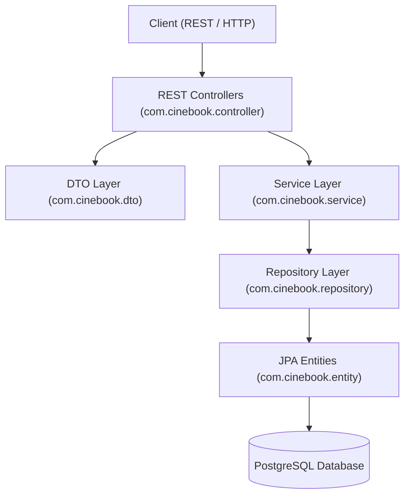
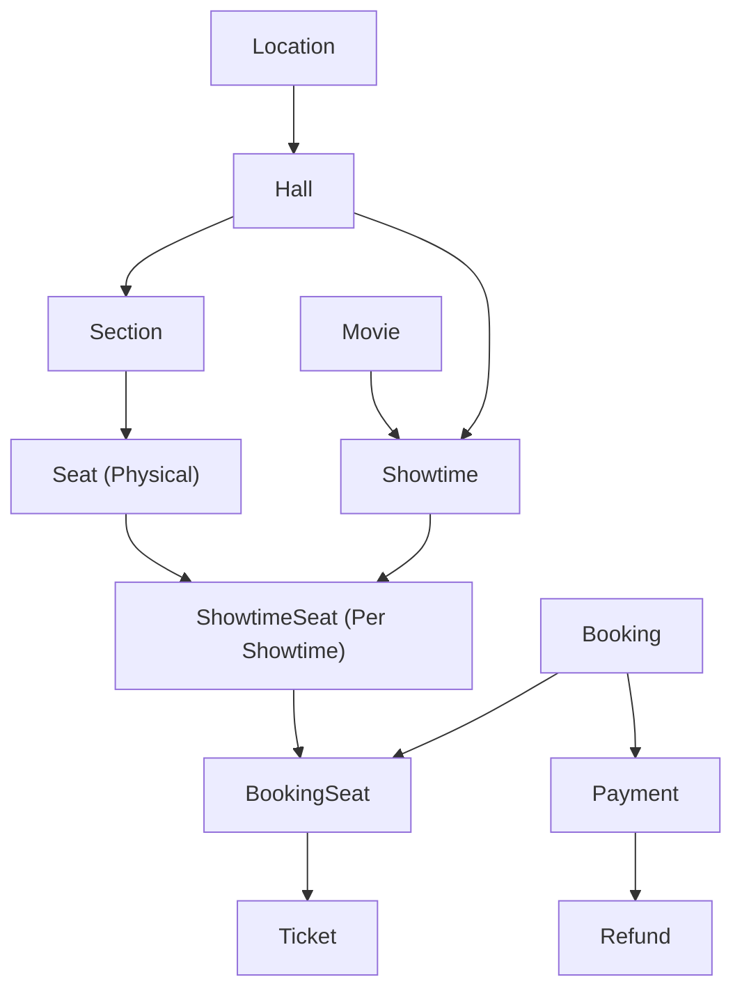

# CineBook

A Spring Boot backend application for online cinema movie ticket booking, seat reservation, payment simulation, ticket lifecycle management, and admin management.

## Overview

CineBook is designed to model the backend operations of a modern online cinema booking system. It handles cinema venue management, showtime scheduling, showtime-specific seat availability, temporary concurrency-safe seat holds, guest and registered user booking creation, mock payment integration, QR-based ticket generation and check-in, and policy-driven booking cancellation and refunds.

The application emphasizes clean architecture, transactional consistency, concurrency control, and domain-driven separation between physical cinema infrastructure and per-showtime state.

## Features

- **Venue & Infrastructure Management**: Multi-location cinemas, halls, seating sections, and individual physical seats with custom layout positions (X/Y coordinates) and seat types (`REGULAR`, `PREMIUM`, `VIP`, `ACCESSIBLE`).
- **Catalog & Showtime Scheduling**: Movie catalog management and showtime scheduling with overlap conflict detection within the same hall.
- **Showtime Seat Initialization**: Automatic generation of showtime-specific seat availability (`ShowtimeSeat`) initialized to `AVAILABLE` state upon showtime creation.
- **Dynamic Pricing Rules**: Flexible pricing rules configured per showtime, section, and ticket type (`ADULT`, `CHILD`, `STUDENT`, `SENIOR`).
- **Concurrency-Safe Seat Holding**: Temporary seat reservation system (default 5-minute hold) enforcing pessimistic DB row locking (`PESSIMISTIC_WRITE`) to prevent concurrent double-booking.
- **Guest & User Bookings**: Complete guest booking creation without requiring mandatory user registration, alongside support for registered user accounts.
- **Mock Payment Processing**: Decoupled payment provider interface (`PaymentProvider`) supporting payment initialization, mock processing, failure handling, and payment confirmation.
- **Ticket Generation & Check-In**: Automatic generation of individual tickets per booked seat upon payment confirmation, featuring unique QR verification tokens, status tracking (`ACTIVE`, `USED`, `CANCELLED`, `EXPIRED`), and concurrency-safe theatre check-in scanning.
- **Cancellation & Refund Policy**:
  - *Customer Cancellation*: Releases booked seats and cancels tickets with **NO refund**.
  - *Showtime Cancellation*: Cancels all associated bookings, releases seats, cancels active tickets, and issues a **FULL refund** (`SHOW_CANCELLED`) for successful payments while preventing duplicate refunds.
- **Booking Details & History Query**: Full nested booking details lookup by reference (excluding sensitive `qrToken` data and payment credentials) and paginated booking history for registered users (`createdAt DESC`).
- **Admin Management APIs**: Comprehensive administrative endpoints for managing movies, locations, halls, sections, seats, showtimes, and pricing rules with historical reference deletion protection (`409 CONFLICT`).

## Architecture

CineBook follows a layered Spring Boot architectural pattern:



### Domain Architecture Overview



## Core Booking Flow

The primary lifecycle for reserving tickets in CineBook follows these steps:

1. **Browse Catalog**: Retrieve available movies, cinema locations, halls, and showtimes.
2. **View Seat Map**: Query seat availability (`GET /api/showtimes/{id}/seats`) showing `AVAILABLE`, `HELD`, or `BOOKED` states.
3. **Hold Seats**: Reserve selected seats temporarily (`POST /api/showtimes/{id}/seats/hold`). Seats are placed on a 5-minute hold.
4. **Create Booking**: Submit customer information (`POST /api/showtimes/{id}/bookings`) to generate a `PENDING` booking reference (e.g., `CB-8F4K2M`).
5. **Process Payment**: Initiate and confirm payment (`POST /api/bookings/{ref}/payment` and `POST /api/payments/{id}/confirm`).
6. **Generate Tickets**: Payment confirmation converts booking status to `CONFIRMED` and generates individual `ACTIVE` tickets with unique QR tokens.
7. **Theatre Check-In**: Cinema staff scan ticket QR tokens (`POST /api/tickets/check-in/{qrToken}`) to mark tickets as `USED` with verification timestamps.

## Cancellation & Refund Policy

| Trigger | Booking Status | Seats | Tickets | Refund |
| :--- | :--- | :--- | :--- | :--- |
| **Customer Cancellation** | `CANCELLED` | Released to `AVAILABLE` | Marked `CANCELLED` | **No Refund** |
| **Cinema Showtime Cancellation** | `CANCELLED` | Released to `AVAILABLE` | Marked `CANCELLED` | **Full Refund** (`SHOW_CANCELLED`) |

## Database

The application uses PostgreSQL managed through Flyway schema migrations:

- `V1__initial_schema.sql`: Initializes the core 14 tables (`locations`, `halls`, `sections`, `seats`, `movies`, `showtimes`, `showtime_seats`, `pricing_rules`, `users`, `bookings`, `booking_seats`, `tickets`, `payments`, `refunds`).
- `V2__seed_development_data.sql`: Seeds realistic development data including cinema venues, halls, physical seats, movies, showtimes, and pricing rules.

### Design Integrity
- Monetary values use `BigDecimal` / `NUMERIC(12,2)`.
- Timestamps are stored as timezone-aware `TIMESTAMPTZ` values mapped to `OffsetDateTime`.
- Historical transactional records (bookings, payments, tickets, refunds) are preserved rather than physically deleted.

## API Overview

### Health
| Method | Endpoint | Description |
| :--- | :--- | :--- |
| `GET` | `/api/health` | Application health check status |

### Movies
| Method | Endpoint | Description |
| :--- | :--- | :--- |
| `GET` | `/api/movies` | List all active movies |
| `GET` | `/api/movies/{id}` | Get movie details by ID |
| `GET` | `/api/movies/{id}/showtimes` | Get scheduled showtimes for a movie |

### Locations & Halls
| Method | Endpoint | Description |
| :--- | :--- | :--- |
| `GET` | `/api/locations` | List all cinema locations |
| `GET` | `/api/locations/{id}` | Get location details by ID |
| `GET` | `/api/locations/{id}/halls` | Get halls in a cinema location |
| `GET` | `/api/halls/{id}` | Get hall details by ID |
| `GET` | `/api/halls/{id}/sections` | Get seating sections in a hall |
| `GET` | `/api/halls/{id}/seats` | Get all physical seats in a hall |

### Sections & Seats
| Method | Endpoint | Description |
| :--- | :--- | :--- |
| `GET` | `/api/sections/{id}` | Get section details by ID |
| `GET` | `/api/sections/{sectionId}/seats` | Get physical seats in a section |
| `GET` | `/api/seats/{id}` | Get seat details by ID |

### Showtimes & Seat Availability
| Method | Endpoint | Description |
| :--- | :--- | :--- |
| `GET` | `/api/showtimes/{id}` | Get showtime details by ID |
| `GET` | `/api/halls/{hallId}/showtimes` | Get showtimes scheduled in a hall |
| `GET` | `/api/showtimes/{showtimeId}/seats` | Get real-time seat availability for a showtime |
| `POST` | `/api/showtimes/{showtimeId}/seats/hold` | Hold seats temporarily (concurrency-safe) |
| `POST` | `/api/showtimes/{showtimeId}/cancel` | Cancel showtime (triggers full refunds) |

### Pricing
| Method | Endpoint | Description |
| :--- | :--- | :--- |
| `GET` | `/api/showtimes/{showtimeId}/pricing` | Get pricing rules for a showtime |

### Bookings & History
| Method | Endpoint | Description |
| :--- | :--- | :--- |
| `POST` | `/api/showtimes/{showtimeId}/bookings` | Create guest booking for held seats |
| `GET` | `/api/bookings/{bookingReference}` | Get complete booking details by reference |
| `GET` | `/api/users/{userId}/bookings` | Get paginated booking history for a user |
| `POST` | `/api/bookings/{bookingReference}/cancel` | Cancel booking (customer-initiated, no refund) |
| `GET` | `/api/bookings/{bookingReference}/refunds` | Get refunds associated with a booking |

### Payments
| Method | Endpoint | Description |
| :--- | :--- | :--- |
| `POST` | `/api/bookings/{bookingReference}/payment` | Initiate payment for a booking |
| `POST` | `/api/payments/{paymentId}/confirm` | Confirm payment attempt |

### Tickets & Check-In
| Method | Endpoint | Description |
| :--- | :--- | :--- |
| `GET` | `/api/bookings/{bookingReference}/tickets` | Get tickets for a booking |
| `GET` | `/api/tickets/{ticketNumber}` | Get ticket details by ticket number |
| `GET` | `/api/tickets/verify/{qrToken}` | Verify ticket status using QR token |
| `POST` | `/api/tickets/check-in/{qrToken}` | Check in ticket at theatre using QR token |

### Refunds
| Method | Endpoint | Description |
| :--- | :--- | :--- |
| `GET` | `/api/refunds/{refundId}` | Get refund details by ID |

### Admin Management
| Method | Endpoint | Description |
| :--- | :--- | :--- |
| `POST` | `/api/admin/movies` | Create a new movie |
| `PUT` | `/api/admin/movies/{id}` | Update movie details |
| `DELETE` | `/api/admin/movies/{id}` | Delete a movie (fails if showtimes exist) |
| `POST` | `/api/admin/locations` | Create a cinema location |
| `PUT` | `/api/admin/locations/{id}` | Update cinema location |
| `DELETE` | `/api/admin/locations/{id}` | Delete cinema location (fails if halls exist) |
| `POST` | `/api/admin/locations/{locationId}/halls` | Create a hall in a location |
| `PUT` | `/api/admin/halls/{id}` | Update hall details |
| `DELETE` | `/api/admin/halls/{id}` | Delete a hall (fails if showtimes/sections exist) |
| `POST` | `/api/admin/halls/{hallId}/sections` | Create a seating section in a hall |
| `POST` | `/api/admin/sections/{sectionId}/seats` | Create physical seat in a section |
| `POST` | `/api/admin/showtimes` | Create showtime (auto-initializes showtime seats) |
| `PUT` | `/api/admin/showtimes/{id}` | Update showtime schedule |
| `POST` | `/api/admin/showtimes/{showtimeId}/pricing` | Create pricing rule for showtime & section |
| `PUT` | `/api/admin/pricing/{id}` | Update pricing rule price |

## Technology Stack

- **Java**: Java 21 LTS
- **Framework**: Spring Boot 4.1.1
- **Web**: Spring MVC / REST (`spring-boot-starter-webmvc`)
- **Data & Persistence**: Spring Data JPA, Hibernate ORM 7.4 (`spring-boot-starter-data-jpa`)
- **Validation**: Jakarta Bean Validation (`spring-boot-starter-validation`)
- **Monitoring**: Spring Boot Actuator (`spring-boot-starter-actuator`)
- **Database**: PostgreSQL 14+
- **Database Migrations**: Flyway Core & Flyway PostgreSQL (`flyway-core`, `flyway-database-postgresql`)
- **Build Tool**: Apache Maven
- **Testing**: JUnit 5, Mockito, Spring Boot Test Suite

## Project Structure

```text
com.cinebook
├── config          # Application configuration beans
├── controller      # Customer REST controllers
│   └── admin       # Administrative REST controllers
├── dto             # Record-based Data Transfer Objects
├── entity          # JPA Domain Entities
│   └── enums       # Domain Enumerations
├── exception       # Global Exception Handler and custom exceptions
├── payment         # Decoupled PaymentProvider abstraction & Mock provider
├── repository      # Spring Data JPA Repositories
└── service         # Business logic & transactional service layer
```

## Getting Started

### Prerequisites
- JDK 21 or later
- PostgreSQL 14+ database instance
- Maven 3.8+ (or Maven Wrapper `mvnw.cmd` / `./mvnw`)

### Configuration

Set up your environment variables or adjust `src/main/resources/application.properties`:

```properties
spring.datasource.url=jdbc:postgresql://localhost:5432/cinebook
spring.datasource.username=postgres
spring.datasource.password=postgres
spring.jpa.hibernate.ddl-auto=none
spring.flyway.enabled=true
```

### Build and Run

1. **Clone the repository**:
   ```bash
   git clone https://github.com/Harithkeshan/CineBook.git
   cd cinebook-backend
   ```

2. **Compile the application**:
   ```bash
   .\mvnw.cmd clean compile
   ```

3. **Run automated tests**:
   ```bash
   .\mvnw.cmd test
   ```

4. **Start the application**:
   ```bash
   .\mvnw.cmd spring-boot:run
   ```
   Flyway will automatically execute database migrations (`V1` schema initialization and `V2` development seed data) on startup.

5. **Verify health endpoint**:
   ```bash
   curl http://localhost:8080/api/health
   ```

## Testing

The project includes an extensive unit and integration test suite (120 tests) covering:
- Concurrency-safe seat holding (`ShowtimeSeatConcurrencyTest`)
- Seat availability & expiration rules (`ShowtimeSeatServiceTest`)
- Guest booking creation & price calculation (`BookingServiceTest`)
- Payment processing & state transitions (`PaymentServiceTest`)
- End-to-end booking and payment integration (`EndToEndBookingPaymentIntegrationTest`)
- Ticket generation, QR verification, and concurrency-safe check-in (`TicketServiceTest`, `TicketCheckInConcurrencyTest`)
- Customer booking cancellation and showtime refund workflows (`BookingCancellationTest`, `ShowtimeCancellationTest`)
- Booking query details & user booking history pagination (`BookingQueryServiceTest`)
- Admin management CRUD, schedule overlap detection, and deletion safety (`AdminManagementServiceTest`)

Run tests via Maven:
```bash
.\mvnw.cmd test
```

## Current Scope

The current implementation provides a fully tested, functional REST API backend for cinema booking operations, seat holding, payment simulation, ticket verification, cancellation refunds, and admin venue/schedule configuration.

Authentication and security filters have intentionally been omitted in the current scope to focus on domain correctness.

## Future Improvements

- **Authentication & Authorization**: Integrate Spring Security with JWT for user accounts and role-based access control (`ROLE_ADMIN`, `ROLE_CUSTOMER`).
- **Real Payment Gateway**: Integrate real payment gateway SDKs (such as PayHere).
- **Frontend Integration**: Develop a responsive web or mobile frontend application.
- **Containerization**: Create Dockerfile and `docker-compose.yml` configuration.
- **CI/CD Pipeline**: Setup automated GitHub Actions workflows for continuous integration.
- **Notifications**: Email and SMS confirmation delivery for tickets and cancellations.

## License

No license has currently been specified for this project.
