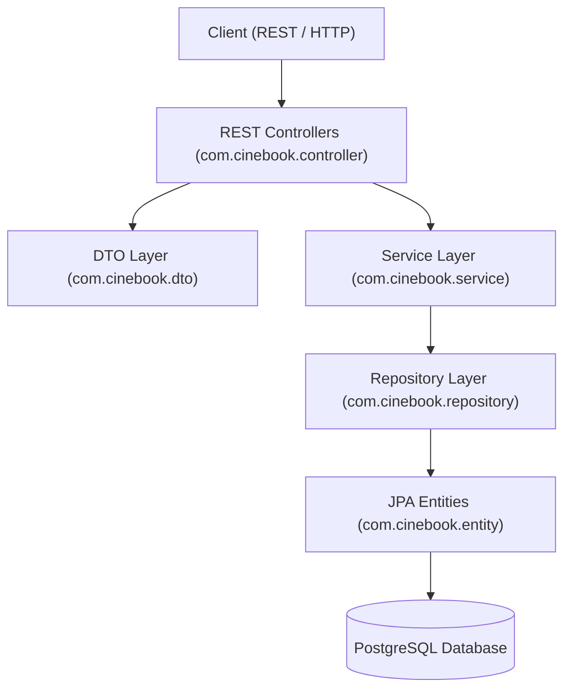

# CineBook

A Spring Boot backend for online cinema ticket booking, real-time seat holding, payment processing simulation, QR-based ticket verification, and admin venue management.

## Overview

CineBook models the backend operations of a modern online cinema chain. It handles cinema venue management, showtime scheduling, showtime-specific seat availability, concurrency-safe seat holds, guest and registered user booking creation, mock payment processing, QR ticket generation and check-in, and policy-driven cancellation and refunds.

The application emphasizes clean architecture, transactional consistency, concurrency control, and domain-driven separation between physical cinema infrastructure and per-showtime state.

## Key Features

- **Venue & Infrastructure Management**: Multi-location cinemas, halls, seating sections, and physical seats with layout coordinates and seat tiers.
- **Showtime Seat Availability**: Automatic generation of showtime-specific seat availability (`ShowtimeSeat`) upon showtime creation.
- **Concurrency-Safe Seat Holding**: Temporary seat reservation (default 5-minute hold) enforcing pessimistic DB row locking (`PESSIMISTIC_WRITE`) to prevent concurrent double-booking.
- **Guest & User Bookings**: Guest checkout without mandatory user registration, alongside support for registered user account booking history.
- **Ticket Generation & QR Check-In**: Individual ticket generation per booked seat upon payment confirmation, featuring unique QR verification tokens and concurrency-safe theatre check-in scanning.
- **Policy-Driven Refunds**: Customer cancellation releases seats without refund; cinema showtime cancellation triggers automatic full refunds (`SHOW_CANCELLED`).
- **Admin Management APIs**: Comprehensive administrative endpoints for managing movies, locations, halls, sections, seats, showtimes, and pricing rules with deletion safety.

## Architecture

CineBook follows a layered Spring Boot architectural pattern:



## Core Booking Flow

1. **Browse Catalog**: Retrieve movies, locations, halls, and showtimes (`GET /api/movies`, `GET /api/showtimes/{id}`).
2. **View Seat Map**: Query real-time seat availability (`GET /api/showtimes/{id}/seats`).
3. **Hold Seats**: Reserve seats temporarily (`POST /api/showtimes/{id}/seats/hold`) with a 5-minute expiration window.
4. **Create Booking**: Submit customer details (`POST /api/showtimes/{id}/bookings`) to generate a `PENDING` booking reference.
5. **Process Payment**: Initiate and confirm payment (`POST /api/bookings/{ref}/payment`, `POST /api/payments/{id}/confirm`).
6. **Generate Tickets**: Confirming payment marks the booking `CONFIRMED` and issues `ACTIVE` tickets with unique QR tokens.
7. **Theatre Check-In**: Scan QR tokens at the cinema (`POST /api/tickets/check-in/{qrToken}`) to mark tickets as `USED`.

## Cancellation & Refund Policy

| Trigger | Booking Status | Seat Status | Ticket Status | Refund Policy |
| :--- | :--- | :--- | :--- | :--- |
| **Customer Cancellation** | `CANCELLED` | Released to `AVAILABLE` | Marked `CANCELLED` | **No Refund** |
| **Cinema Showtime Cancellation** | `CANCELLED` | Released to `AVAILABLE` | Marked `CANCELLED` | **Full Refund** (`SHOW_CANCELLED`) |

## API Reference

| Category | Method | Endpoint | Description |
| :--- | :--- | :--- | :--- |
| **Health** | `GET` | `/api/health` | Service health status |
| **Catalog** | `GET` | `/api/movies` | List active movies |
| | `GET` | `/api/locations` | List cinema locations & halls |
| | `GET` | `/api/movies/{id}/showtimes` | List scheduled showtimes for a movie |
| **Seats** | `GET` | `/api/showtimes/{id}/seats` | Real-time seat availability for a showtime |
| | `POST` | `/api/showtimes/{id}/seats/hold` | Hold seats temporarily (concurrency-safe) |
| **Bookings** | `POST` | `/api/showtimes/{id}/bookings` | Create guest booking for held seats |
| | `GET` | `/api/bookings/{ref}` | Get complete booking details by reference |
| | `GET` | `/api/users/{userId}/bookings` | Paginated booking history for registered user |
| | `POST` | `/api/bookings/{ref}/cancel` | Cancel booking (customer-initiated, no refund) |
| **Payments** | `POST` | `/api/bookings/{ref}/payment` | Initiate payment attempt |
| | `POST` | `/api/payments/{id}/confirm` | Confirm payment attempt |
| **Tickets** | `GET` | `/api/bookings/{ref}/tickets` | List tickets issued for a booking |
| | `GET` | `/api/tickets/verify/{qrToken}` | Verify ticket validity via QR token |
| | `POST` | `/api/tickets/check-in/{qrToken}` | Check in ticket at theatre via QR token |
| **Showtimes** | `POST` | `/api/showtimes/{id}/cancel` | Cancel showtime (triggers full customer refunds) |
| **Admin** | `POST` / `PUT` / `DELETE` | `/api/admin/...` | Administrative CRUD for movies, locations, halls, sections, seats, showtimes, and pricing rules |

## Tech Stack

- **Language**: Java 21 LTS
- **Framework**: Spring Boot 4.1.1 (Spring MVC, Spring Data JPA, Spring Validation, Actuator)
- **Database**: PostgreSQL 14+ with Flyway migrations
- **Build & Test**: Apache Maven, JUnit 5, Mockito

## Getting Started & Testing

### Prerequisites
- Java 21+
- PostgreSQL 14+ database instance

### Quick Start

1. **Clone the repository**:
   ```bash
   git clone https://github.com/Harithkeshan/CineBook.git
   cd cinebook-backend
   ```

2. **Configure Database**: Update `src/main/resources/application.properties` with your PostgreSQL credentials.

3. **Run Automated Tests**:
   ```bash
   .\mvnw.cmd test
   ```
   *(Executes 120 unit and integration tests covering concurrency, seat holding, payment flows, ticket check-in, refunds, and admin operations)*

4. **Start Application**:
   ```bash
   .\mvnw.cmd spring-boot:run
   ```
   *(Flyway automatically applies database schema migrations and development seed data)*

## Future Roadmap

- **Authentication & Security**: Spring Security with JWT tokens for user and admin authorization.
- **Real Payment Gateway**: Payment gateway SDK integration (e.g. PayHere).
- **Frontend App**: Interactive web dashboard and visual seat selection UI.
- **Containerization**: Dockerfile and Docker Compose orchestration.
- **Notifications**: Automated email/SMS ticket and cancellation notifications.

## License

No license has currently been specified for this project.
